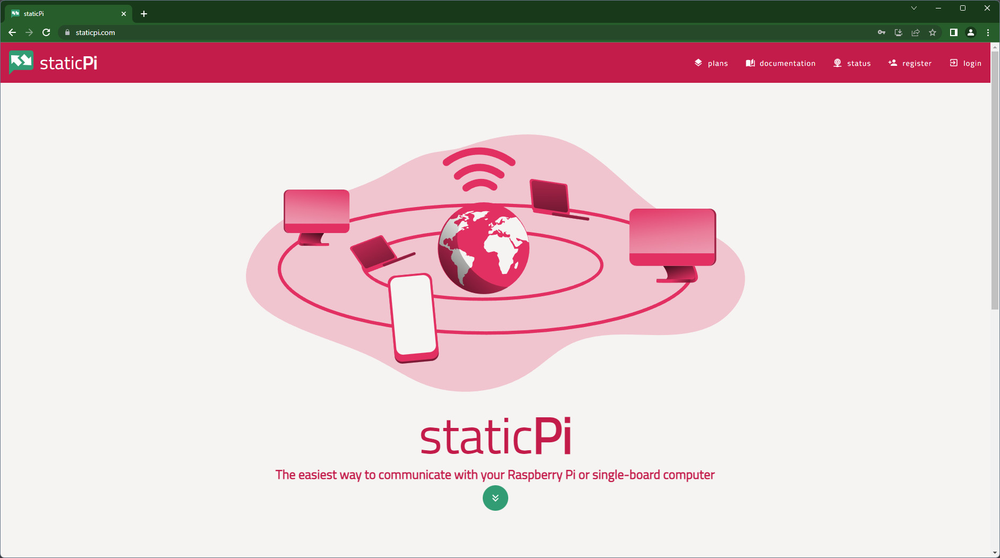
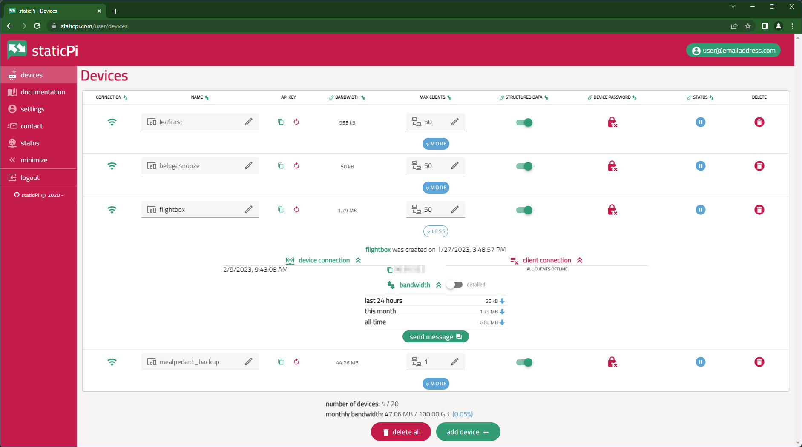

<p align="center">
	
</p>

<h1 align="center">staticPi website</h1>

<p align="center">
	The frontend for <a href='https://www.staticpi.com' target='_blank' rel='noopener noreferrer'>https://www.staticpi.com</a>,
	<br>backend code <a href='https://www.github.com/mrjackwills/staticpi_backend' target='_blank' rel='noopener noreferrer'>(soon to be seen) here</a>
</p>
<p align="center">
	Built using <a href='https://vuejs.org/' target='_blank' rel='noopener noreferrer'>vue.js</a>,
	in <a href='https://www.typescriptlang.org' target='_blank' rel='noopener noreferrer'>Typescript</a>,
	using <a href='https://vitejs.dev/' target='_blank' rel='noopener noreferrer'>vite</a>,
	and <a href='https://vuetifyjs.com/en/' target='_blank' rel='noopener noreferrer'>Vuetify</a>,
</p>


## Screenshots

<p align="center">
	<a href="https://raw.githubusercontent.com/mrjackwills/staticpi_vue/main/.github/site_screenshot_01.jpg" target='_blank' rel='noopener noreferrer'>
		
	</a>
	&nbsp;&nbsp;
	<a href="https://raw.githubusercontent.com/mrjackwills/staticpi_vue/main/.github/site_screenshot_02.jpg" target='_blank' rel='noopener noreferrer'>
		
	</a>
</p>

## Features

<ul>
	<li>PWA with Desktop & Mobile layout</li>
	<li>Brotli & Gzipped compressed output</li>
	<li>Weak password resolution & rejection, powered by <a href='https://haveibeenpwned.com/' target='_blank' rel='noopener noreferrer'>hibp</a></li>
	<li><a href="https://pinia.vuejs.org/" target='_blank' rel='noopener noreferrer'>Pinia</a> for local data storage</li>
	<li>Client side routing with <a href="https://router.vuejs.org/" target='_blank' rel='noopener noreferrer'>Vue Router</a></li>
	<li>Restricted (server side validated) User & Admin User areas</li>
	<li>Form validation with <a href="https://vuelidate.js.org/" target='_blank' rel='noopener noreferrer'>Vuelidate</a></li>
	<li>Client side WebSocket message handler</li>
	<li>QR code creation</li>
	<li>Github release workflow</li>
	<li><a href='https://securitytxt.org/' target='_blank' rel='noopener noreferrer'>security.txt</a></li>
</ul>

Invite available on request 

## Required software

1) <a href='https://nodejs.org/en/' target='_blank' rel='noopener noreferrer'>Node.js</a> - runtime

File that are required by staticPi
| file | reason|
|---|---|
|```./.env.development```	| development environmental variables|
|```./.env.production```	| productions environmental variables|

### Development

Use `.devcontainer/Dockerfile` to create an ideal dev environment

1) Install all required packages ```npm install```

2) Run locally ```npm run serve```

### Build step
---
```npm run build```